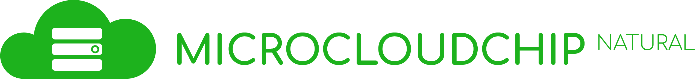

# Home

## Introduction

MicroCloudChip-Natural 은 원격 서버  및 NAS Server의 파일 관리 기능을 지원하기 위해 개발된 **설치형 저용량** **파일 호스팅 서비스** 입니다. 다른 Cloud Service처럼 일정한 비용 용량을 할당 받는 방식이 아닌  사용자가 직접 설치해서 사용하는 방식으로 자신만의 원격 서버를 가지고 있다면 언제든지 간편하게 설치해서 활용할 수 있습니다.

이 어플리케이션을 개발하기 1년전, 개인 서버에 파일들을 관리하기 위해 Docker를 이용하여 Nextcloud를 설치하려고 시도했으나, 실패를 하게 되고, 이는 파일 관리 어플리케이션을 개발하기로 결정하는 데 많은 영향을 주게 됩니다.

2020년 12월, Microcloudchip의 초기 버전을 완성하는 데 성공했으나, 그 당시 DJango의 D자도 모르는 상태에서 맨땅에 헤딩하는 식으로 시작하게 되었고 Frontend Framework(React, Vue ...)를 활용할 줄 몰라, Jquery를 사용하던 시절이었기에 각종 날코딩과 무분별한 설계로 인 심각한 오류를 초래하였고 유지 보수를 시작한 지 약 2개월 만에 개발을 중단하게 됩니다.

하지만, 몇달 간, 여러 개발 방법론과  DJango, React의 기초 지식들을 습득을 하고 약 6주 간의 개발 기간을 거쳐 안정적으로 초기 버전 Release에 성공하게 되었습니다. 이 프로젝트는 계속 업데이트를 해 나갈 것입니다.

## Links

* Github
  * [Microcloudchip (Old Version)](https://github.com/SweetCase-Cobalto/MicroCloudChip)
  * [Microcloudchip-NATURAL (source code)](https://github.com/SweetCase-Cobalto/MicroCloudChip-NATURAL.git)
