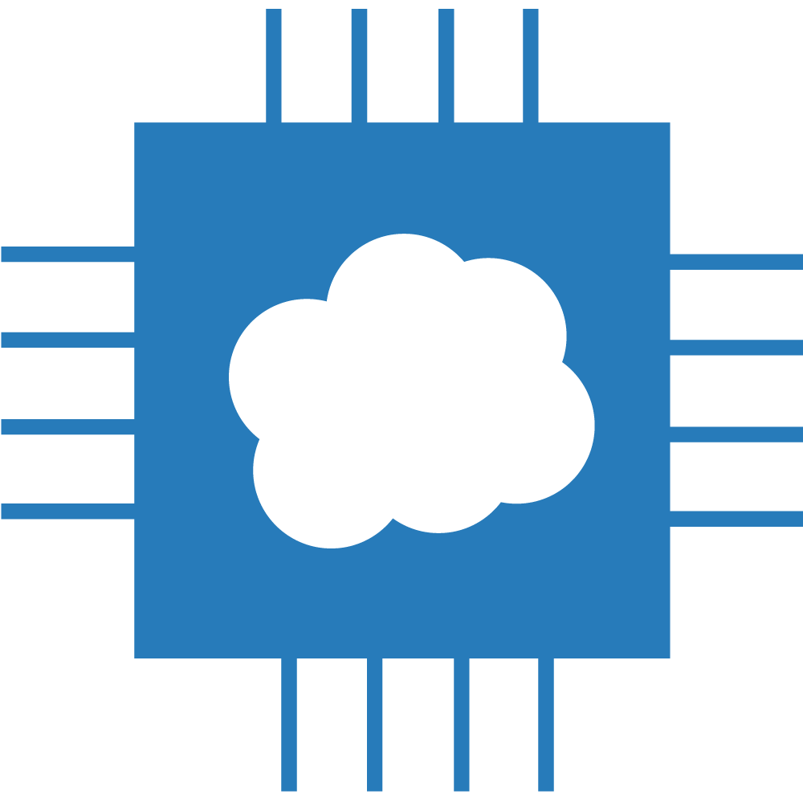

# Different From Microcloudchip(Old)

##  로고 비교

  

 왼쪽: 구버전, 오른쪽: 현재 

## 비교


<mark style="color:red;">삘긴: 개발 예정</mark>

<mark style="color:blue;">파란색 굵게: 개발  중</mark>_**  **_


| Item                     | Microcloudchip | Microcloudchip-NATURAL                                                                  |
| ------------------------ | -------------- | --------------------------------------------------------------------------------------- |
| Framework(Backend)       | DJango         | DJango(with gunicorn)                                                                   |
| Framework(Frontend)      | JQuery         | ReactJS(Javascript)                                                                     |
| Available Database       | Sqlite3        | Sqlite3, MySQL, MariaDB                                                                 |
| User Auth                | Session        | JWT                                                                                     |
| Platform(Server)         | Linux(Debian)  | Linux(Debian)_**, **_<mark style="color:blue;">Windows</mark>                           |
| Platform(Client)         | PC             | PC,** **<mark style="color:red;">Android</mark>_, _<mark style="color:blue;">CLI</mark> |
| 설치 방식                    | Docker         | Docker,** **<mark style="color:blue;">Linux Service</mark>                              |
| 개발 전략                    | X              | TDD                                                                                     |
| RESTful                  | X              | O                                                                                       |
| External Storage Support | X              | O                                                                                       |

## 세부 사항

### Frontend

* **Old**: 하나의 서버가 Frontend, Backend를 담당해야 했기 때문에 JQuery를 사용했습니다. 그렇기 때문에 웹 URL만 있어, 플랫폼(Client)의 범위를 PC에서 Mobile 같은 다른 플랫폼으로 확장하기가 어렵습니다.
* **New**: ReactJS를 사용하여 build된 Web Client용 URL과 Backend API가 분리되어 있습니다. 따라서 다른 플랫폼으로 확장 하더라도 Backend API 와 통신만 하면 되기 때문에 확장이 쉽습니다.


Microcloudchip-NATURAL 은 React Code를 Build하여 DJango의 template와 static directory 에 복해서 서비스 하는 방식으로 운영되고 있습니다.


### Available Database

* **Old**: 내부 저장소인 sqlite3 만 사용합니다. 자체 백업 기능이 있다면 복구를 할 수도 있겠지만 얘는 복구 기능이 없습니다.
* **New:  **MySQL 같은 외부 데이터 저장소를 사용할 수 있습니다. 불가피 하게 어플리케이션이 손상 되어서 다시 복구를 할 때 복구 기능을 사용하여 사용자 정보 등을 복구 할 수 있습니다._ (복구 기능은 개발 중 입니다.) _

### User Auth

* Natural은 _사용자 정보를 저장하지 않는다.  _라는 RESTful의 특징 중 하나 인_ _Serverless에 맞게 Old Version 처럼 Session을 사용하지 않습니다.
* JWT방식을 사용합니다. 클라이언트가 token과 함께 API를 요청하면 서버는 이를 받고 복호화 하여 추출된 정보를 확인함으로써 보안 인증을 진행하기 때문에 **Server는 Client의 정보를 일절 저장하지 않습니다.**

### Platform(Server)

* **Old:** 한때 CentOS 까지 설치할 수 있게 구현을 하려고 했으나 개발 중단으로 Debian 계열만 지원합니다.
* **New: **Debian 뿐만이 아닌, Windows에서도 작동이 되는 것을 목표로 개발하고 있습니다. 단 Windows용은 Server Testing 용도로만 구현될 예정입니다.

### Platform(Client)

* Frontend 에서도 언급된 부분이지만,  Frontend URL과 Backend API의 구별을 둠으로써 다른 플랫폼에서도 확장을 할 수 있습니다.

### 설치 방식

* **old: **Docker만 지원합니다. Docker가 아닌 본 서버 내에서도 실행할 수 있지만 Service 형태로 실행을 할 수 없습니다.
* **new:  **Docker 뿐만이 아니라 Perl 기반의 스크립트를 사용하여 Service file을 생성하고 Service 단위로 실행할 수 있게 해줍니다. (현재 개발중에 있고 0.1.0에 릴리즈 될 예정입니다.)

###  개발 전략

* Microcloudchip 부터 시작해서 여러 개의 프로젝트들이 계속 무산되었는데 가장 큰 원인 중 하나가 잦은 에러와 날코딩으로 인한 코드의 복잡성 이었습니다. 이를 해결하기 위해 TDD를 도입하게 되었고 그 결과 실수와 에러가 크게 줄어들었습니다.

### External Storage Support (In docker container)

* **old: **Docker 외의 스토리지를 마운팅 해서 사용할 수 없기 때문에 docker container에 치명적 오류가 발생해서 삭제를 해야 하는 상황이 와도 복구할 수 없습니다.
* **new: **외부 스토리지를 마운팅해서 사용할 수 있기 때문에 docker container가 망가져도 데이터가 그대로 유지가 됩니다.
