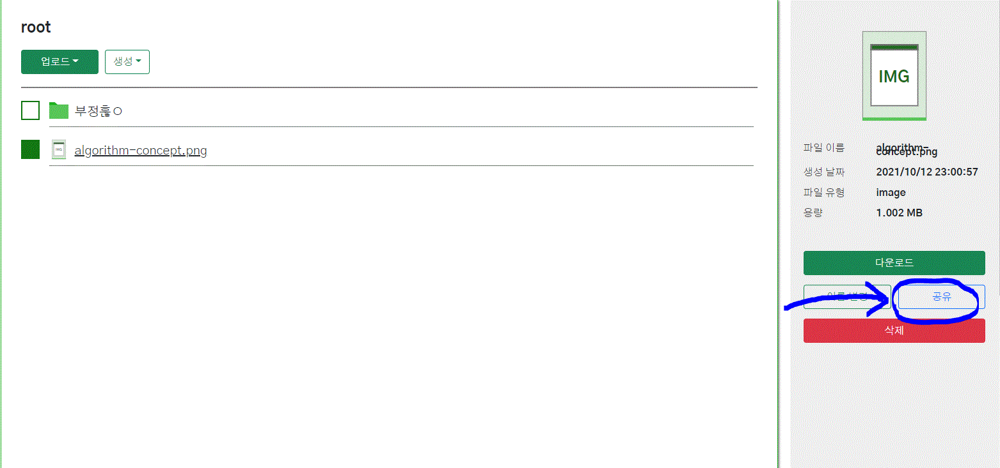

# Share File

파일 공유 기능은 0.1.0 버전에 새로 추가되었습니다. 

## Share File

공유 하고 싶은 파일을 선택한 다음 우측에  공유 버튼을 선택합니다.

.GIF>)

공유 성공 창이 뜨면 밑의 url를 복사해서 브라우저로 접속합니다.

.png>)

다운로드 버튼을 누르면 다운받을 수 있습니다.

## Unshare File

.png>)

공유를 취소하고 싶은 파일을 선택해 공유 취소 버튼을 클릭합니다

.png>)

공유 해제에 성공했으면 위와 같은 메세지가 출력됩니다.
